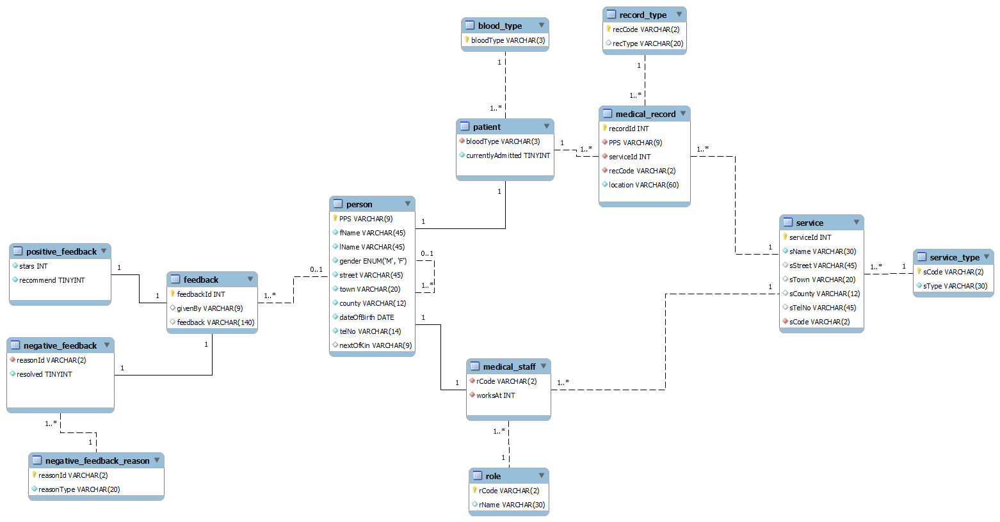

# HSE Database System

Hypothetical [HSE](https://www.hse.ie/) SQL database design and implementation.

*(CA submission for SETU SSD Database Systems module)*

## Features

- Database design based on research about HSE and its services
- EER model
- Estimated calculations for the database size using different super/sub models
- SQL implementation of the database including descriptive comments
- SQL user roles and permissions
- Example SQL queries for the database
- Example data for the database

## Files

- `HSE.pdf` - Database design report
- `HSE.sql` - SQL implementation of the database
- `HSE.mwb` - MySQL Workbench file for the EER model